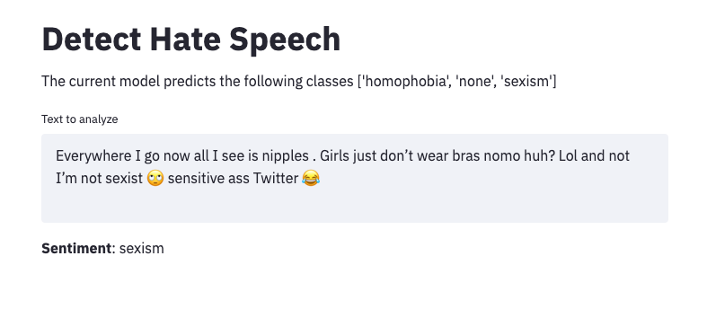

Detect Hate Speech
###############

A small solution for targeting Homophobic and Sexist Tweets to be reported to Twitter by Data For Good, Israel.

.. contents::

.. section-numbering::

Data Collection
===============
We merge multiple dataset:

- We are using hate speech dataset from 
    - https://github.com/ZeerakW/hatespeech and
    - https://data.world/thomasrdavidson/hate-speech-and-offensive-language
- We are scrapping sexist and homophobic tweets thanks to hashtags and doing special annotation.

Solution
========

A Text Classification Model using a Calibrated SGD model and TF-IDF features.

Webapp
======

We are using Streamlit for this tool.

Locally
-------

.. code-block:: bash

  cd DetectHateSpeech
  streamlit run webapp/webapp.py

Live example with Heroku
------------------------

For the webapp to work on `heroku <https://www.heroku.com>`_, 3 files are added: `Procfile <Procfile>`_, `runtime.txt <runtime.txt>`_ and `setup.sh <setup.sh>`_.

You can access to the live webapp `here <https://detecthatespeech.herokuapp.com>`_.

Metric Results
=============

.. code-block:: bash

              precision    recall  f1-score   support

  homophobia       0.88      0.82      0.85        17
        none       0.93      0.98      0.95      4949
      sexism       0.84      0.53      0.65       836

   micro avg       0.92      0.92      0.92      5802
   macro avg       0.88      0.78      0.82      5802
   weighted avg       0.91      0.92      0.91      5802

-------------------------------------------------------

Installation
============

.. code-block:: bash

  pip install -r requirements.txt

Contributing
============
Author and current maintainer are the Data For Good Team.

You are more than welcome to approach us for help and contributions are very welcomed!

Research
========
You can find our research notebook  `here <https://nbviewer.jupyter.org/github/DataforGoodIsrael/DetectHateSpeech/blob/master/research/sexisme_detection_model_panel.ipynb>`_.

We tried different methods to tackle this problem: Word2Vec, Transformers, NN.

To be continued...

Improvement and Next Steps
==========================

- Collect more data with less biased labelling.
- Use this article: Sai Saketh Aluru, Binny Mathew, Punyajoy Saha and Animesh Mukherjee. "Deep Learning Models for Multilingual Hate Speech Detection". https://arxiv.org/pdf/2004.06465.pdf. We used it in the research part, let's implement it!
- Working on the improving the model infrastructure.
- Creating a way to integrate our model and WebApp with Twitter or other system for social media moderators (Add-On, API)

Installing for development
==========================

Clone:

.. code-block:: bash

  git clone https://github.com/DataforGoodIsrael/DetectHateSpeech.git

Credits
=======
Created by Jeremy Atia and Samuel Jefroykin from Data For Good Israel.

Contact us at hello@dataforgoodisrael.com
